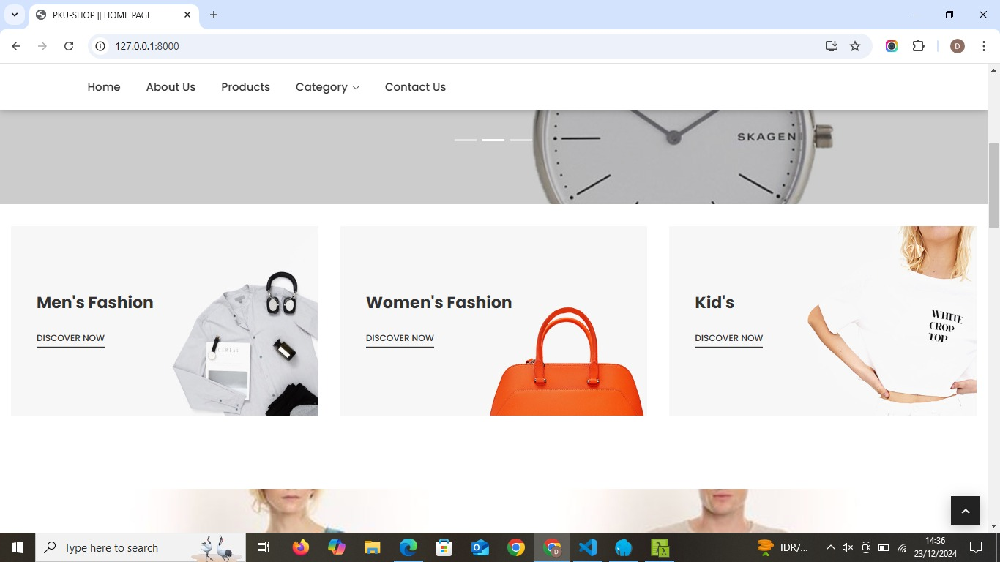

# Pku - Shop (Ecommerce)

## Team Members
- TIO MARIANA
- IRA WIDYA SRI REZEKI 
- INDRIYANI 
- SARI SEPTIANI LUMBAN TOBING
- NURUL MAHARANI

## Overview
This repository contains the Entity-Relationship Diagram (ERD) for our database project. The diagram visualizes the structure and relationships between tables used in the database.

## ERD Diagram


## Relationships
1. **Users ↔ Carts**: One-to-Many relationship (1 user can have multiple carts).
2. **Products ↔ Carts**: One-to-Many relationship (1 product can appear in multiple carts).
3. **Categories ↔ Products**: One-to-Many relationship (1 category can include multiple products).
4. **Users ↔ Orders**: One-to-Many relationship (1 user can place multiple orders).
5. **Users ↔ Wishlists**: One-to-Many relationship (1 user can have multiple wishlist items).
6. **Products ↔ Wishlists**: One-to-Many relationship (1 product can appear in multiple wishlists).

## Program Description
This project is an **e-commerce platform (Pku-Shop)** designed to manage products, users, and transactions efficiently. The key functionalities include:

1. **Banner Management (`banners` table)**  
   Used to display promotional banners on the website. Admins can activate or deactivate banners and associate them with images and descriptions.

2. **Product Catalog (`products`, `categories`, and `brands` tables)**  
   - Products are organized into categories and associated with brands.
   - Each product has attributes such as stock, size, condition, price, and discount.
   - Categories can have parent-child relationships to form a hierarchy.

3. **User Accounts (`users` table)**  
   - Supports both regular users and admins.
   - Handles user authentication and authorization, with roles and status management.

4. **Shopping and Transactions (`carts`, `orders`, and `wishlists` tables)**  
   - **Cart**: Users can add items to their cart for purchasing, manage quantities, and view the total amount.
   - **Orders**: Captures user orders with payment status and delivery details.
   - **Wishlist**: Allows users to save products for future reference.

5. **Content and Notifications (`posts`, `post_categories`, `post_comments`, and `notifications` tables)**  
   - Blog posts with categories and tags for user engagement.
   - Users can comment on posts, reply to others, and receive notifications about updates.


## Screenshoot Program




## Installation

### Clone the repository

```bash 
git clone https://github.com/irawidyasrirezeki/pku-shop.git
```
### Install Depedencies 
```bash
composer install
```

### Setup Database
Database Name

### Run Server 
```bash
php artisan serve
php artisan storage:link
```